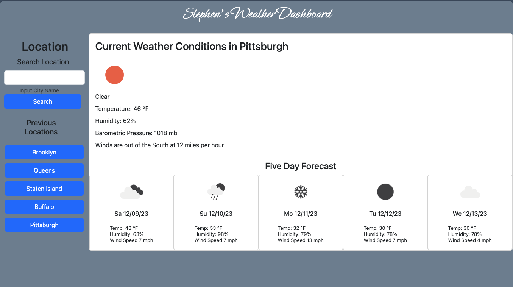

# 06 Server-Side APIs: Weather Dashboard

## User Story

```
AS A traveler
I WANT to see the weather outlook for multiple cities
SO THAT I can plan a trip accordingly
```

## Acceptance Criteria

```
GIVEN a weather dashboard with form inputs
WHEN I search for a city
THEN I am presented with current and future conditions for that city and that city is added to the search history
WHEN I view current weather conditions for that city
THEN I am presented with the city name, the date, an icon representation of weather conditions, the temperature, the humidity, and the wind speed
WHEN I view future weather conditions for that city
THEN I am presented with a 5-day forecast that displays the date, an icon representation of weather conditions, the temperature, the wind speed, and the humidity
WHEN I click on a city in the search history
THEN I am again presented with current and future conditions for that city
```

## Lessons Learned
```
1- Attaching events to elements that don't yet exist (this was big, thanks to Sam, my T/A)
2- Getting more comfortable with bootstrap
3- Retrieving and parsing data from APIs
4- Having a stranger fix a bug in my code :-)
```

## Screenshot



## Application Repo

https://github.com/stephen-scheiman/weatherApp

## Deployed Application

https://stephen-scheiman.github.io/weatherApp/


